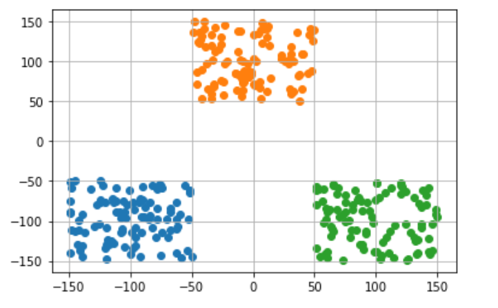
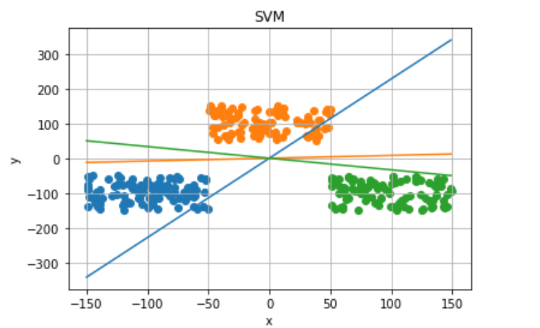

# 多类别支持向量机（SVM）的编程实现
## 1. 功能实现:
- 实现**数据生成器**，生成三簇二维数据点，尝试使用多类别SVM将他们分割开
- 实现**数据加载器**，能够迭代获取制定batch的数据集，并能够shuffle数据集。
- 实现**多类别SVM线性分类器**，并包含如下部分:
  - 前向传播函数
  - 带正则化的损失函数
  - 数值法求解梯度函数
  - Batch梯度下降法优化器
  - 训练函数

## 2.设计思想与运行效果
### **数据生成器**
选取三个质心，在其周围随机采样，获得三簇样本点。
```python
def getData():
    #随机获取三类数据及其标签
    dataMat = []; labelMat = []
    class1 = [[-150+random.randint(1,100),-150+random.randint(1,100)] for i in range(100)]
    class2 = [[-50+random.randint(1,100),50+random.randint(1,100)]  for i in range(100)]
    class3 = [[50+random.randint(1,100),-150+random.randint(1,100)]  for i in range(100)]
    dataMat = class1 + class2 + class3
    labelMat = [0 for i in range(100)] + [1 for j in range(100)] +  [2 for j in range(100)] 
    return dataMat,labelMat
```
生成的样本分布如下图所示：


### **数据加载器**
将数据集访问方式封装为dataloader加载器，能够设置batch_size和shuffle，方便获取数据。实现方法主要为python的迭代器。
```python
class DataLoader:
    # 创建自己的数据加载器
    def __init__(self,X,y,batchsize,shuffle = True):
        self.X = np.array(X)
        self.y = np.array(y)
        self.bs = batchsize
        self.len = len(self.X)
        self.index =  list(range(self.len))
        if shuffle: random.shuffle(self.index)
    
    def __len__(self):
        return self.len

    def __iter__(self):
        self.it = 0
        return self
 
    def __next__(self):
        if self.it < self.len:
            x = self.X[self.index[self.it:min(self.it+self.bs,self.len)]]
            y = self.y[self.index[self.it:min(self.it+self.bs,self.len)]]
            self.it += self.bs
            return x,y
        else:
            raise StopIteration
```

### **损失函数**
实现如下公式的损失函数，能够对输入的小批量数据计算损失，并且使用向量计算更加高效。正则项采用矩阵二范数。
$$L=\frac{1}{N} \sum_{i} \sum_{j \neq y_{i}} \max \left(0, f_{j}-f_{y_{i}}+1\right)+\lambda \sum_{k} \sum_{l} W_{k, l}^{2}$$

```python
def fucn_loss(self,X,labels,w,lam):
    """
    多类别SVM-损失函数
    @param:
        scores: 模型预测分数 M*N数组,M为样本数,N为类别数
        labels: 样本真实标签 M*1整数数组
        lam: 正则项系数
    @return:
        损失函数标量(float)
    """
    delta = 1
    loss = 0
    scores = np.array(X).dot(w)
    for s,y in list(zip(scores,labels)):
        margins = np.maximum(0, s - s[y] + delta)
        margins[y] = 0
        loss += np.sum(margins)

    return loss/len(scores) +lam*np.linalg.norm(w,ord=2)  # 使用二范数作为正则项
```

### **数值法梯度计算**
我实现了一个通用的数值法计算近似梯度的方法，需要输入函数f和求导变量x，能够实现对张量x的近似梯度求解。
```python
def eval_numerical_gradient(self,f, x):
    """  
    使用数值法求解梯度通用算法
    我们是求L关于w的梯度，f就是损失L，x就是权重矩阵w
    一个 f 在 x 处的数值梯度法的简单实现
    - f 是参数 x 的函数，x 是矩阵
    - x 是计算梯度的点
    """ 
    
    fx = f(x) # 计算x点处的函数值
    grad = np.zeros(x.shape)  # 梯度矩阵也是10x3073
    h = 0.00001  # 近似为0的变化量
    
    # 对x中所有的索引进行迭代，比如从（0,0）到（9,3072）
    it = np.nditer(x, flags=['multi_index'], op_flags=['readwrite'])
    # np.nditer是np自带的迭代器
    # flags=['multi_index']表示对 x 进行多重索引 比如(0,0)
    # op_flags=['readwrite']表示不仅可以对x进行read（读取），还可以write（写入）
    while not it.finished:
    
        # 计算x+h处的函数值
        ix = it.multi_index   #索引从(0,0)开始，即从x矩阵第一行第一列的元素开始
        old_value = x[ix]   # 先将x(0,0)处原值保存
        x[ix] = old_value + h # 增加h
        fxh = f(x) # 计算新的f(x + h)
        x[ix] = old_value # 将x(0,0)处改回原值
    
        # 计算偏导数
        grad[ix] = (fxh - fx) / h # x(0,0)处的偏导数
        it.iternext() # 到下个维度x(0,1)
    
    return grad # 最终是计算好的梯度矩阵
```

### **Batch梯度下降法优化器**
实现优化器，对每个batch的样本进行梯度下降法。使用前面实现的数值近似法求解小batch损失对权重w的梯度，然后使用梯度下降法更新权重w。

```python
def optimizer(self,X,labels,lr):
    # 更新参数的优化器
    def batch_loss_fun(W):
        #定义批处理loss函数
        return self.fucn_loss(X,labels,W,0.01)

    grad = self.eval_numerical_gradient(batch_loss_fun,self.W)
    self.W = self.W - lr*grad
```

### **Batch梯度下降法优化器**
设计训练函数，输入训练epoch，数据加载器dataloader，学习率lr和正则项系数lam，能够自动完成数据加载，前向传播损失计算，更新权重，并打印每个迭代（batch）的损失函数。
```python
def train(self,epoch,dataloader,learn_rate=0.01,lam=0.01):
    for i in range(epoch):
        it = iter(dataloader)
        for X,y in it:
            loss = self.fucn_loss(X,y,self.W,lam)
            self.optimizer(X,y,learn_rate)
            print("epoch:{},loss:{}".format(i,loss))
```

### **训练过程与结果**
训练过程代码如下：首先调用dataloader类生成数据加载器，batch_size设为30，并且打乱数据顺序。然后获取svm模型，调用train方法进行训练，训练次数为1000次，学习率为0.001，正则项为0.001.
```python
dl = DataLoader(X=dataMat,y=labelMat,batchsize=30,shuffle=True)
model = SVM()
model.train(epoch=1000,dataloader=dl,learn_rate=0.001,lam=0.001)
```
训练过程中损失函数变化如下：


最终将训练模型收敛，并且将三个类别的超平面绘制到原始数据图像中，如下所示。从中可以看出，每个超平面都将一个类别与另外两个类别分割开。


